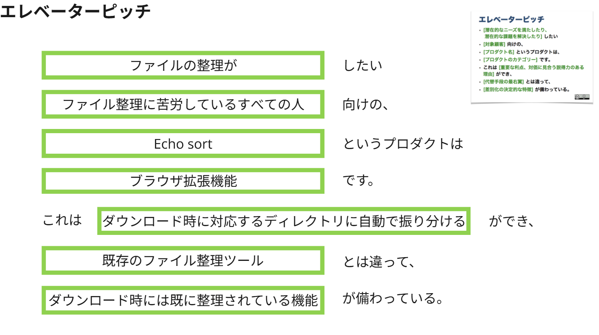

# Echo Sort

> 「もうファイル整理で悩まない」
> ダウンロードするだけで、すべてが片付くブラウザ拡張機能

---

## 概要 (Overview)

「デスクトップやダウンロードフォルダが、いつの間にかファイルで溢れかえってしまう…」
「ファイル整理が面倒で、なかなか手を付けられない…」

**Echo Sort**は、そんな悩みを解決するために開発されたブラウザ拡張機能です。
この拡張機能は、ファイルのダウンロード時にファイルの種類やルールに基づき、適切なディレクトリを自動で作成し、そこへ振り分けてくれます。
もう、あなたが手動でファイルを整理する必要はありません。

## ✨ 主な機能 (Features)

* **自動ディレクトリ作成**: `pdf` `image` `document` など、ファイルの種類に応じたフォルダを自動で作成します。
* **ルールベースの振り分け**: 拡張子やダウンロード元のドメインなど、柔軟なルール設定でファイルを自動的に振り分けます。
* **クリーンな状態を維持**: ダウンロードフォルダを常に整理された状態に保ち、ファイルを探す手間を省きます。
* **簡単なセットアップ**: 直感的なUIで、誰でも簡単に整理ルールを設定できます。

## 💿 インストール (Installation)

現在開発中です。Chromeウェブストアでの公開を予定しています。

開発版を試すには：
1.  このリポジトリをクローンまたはダウンロードします。
2.  Google Chromeで `chrome://extensions` を開きます。
3.  「デベロッパー モード」をオンにします。
4.  「パッケージ化されていない拡張機能を読み込む」をクリックし、クローンしたディレクトリを選択します。

## 使い方 (Usage)

1.  拡張機能のアイコンをクリックして、設定パネルを開きます。
2.  ファイルの振り分けルールを追加・編集します。（例: `*.pdf` は `Documents/PDFs` フォルダに保存する）
3.  あとはファイルをダウンロードするだけ！自動で指定した場所に保存されます。

## 👥 開発メンバー (Team)

* [hira](https://github.com/hr-git61)
* [サカザキ](https://github.com/vaportrail0517)
* [タクト](https://github.com/takuto-s)
* [ヤスヒロ](https://github.com/yasuhiroyagyu)
* [Schnee](https://github.com/schnyy)

## 🤝 コントリビューション (Contributing)

バグ報告、機能提案などのIssueやプルリクエストを歓迎します！
開発に参加したい方は、お気軽にIssueやDiscussionでご連絡ください。

## 📜 ライセンス (License)

このプロジェクトは 　のもとで公開されています。
